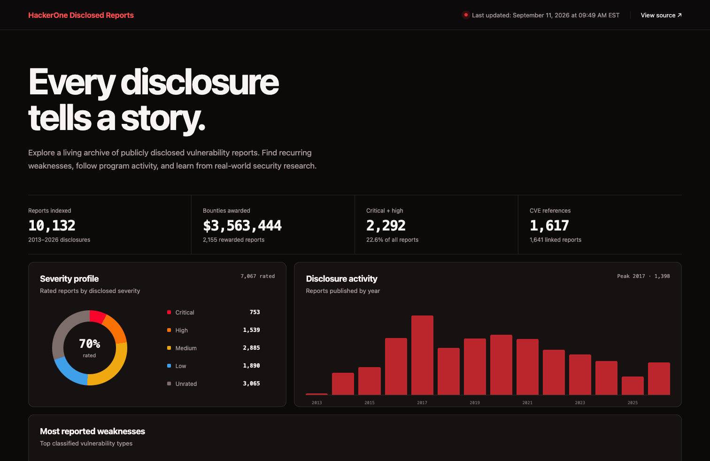
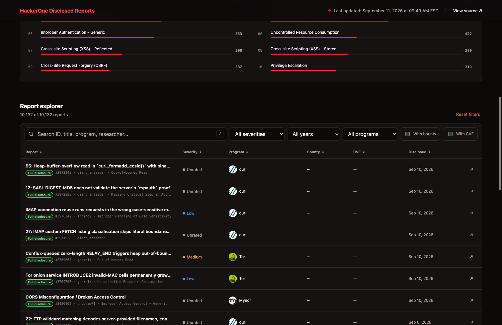

# HackerOne Disclosed Reports

A structured, auto-updated database of publicly disclosed HackerOne vulnerability reports.

## 🌐 Web Dashboard

Use the interactive dashboard to search reports and filter them by severity, year, program, bounty, CVE, weakness, or disclosure date.

**[Open the HackerOne Disclosed Reports dashboard →](https://h1.ajaysenr.com/)**

### Dashboard overview

### Report explorer

## 📊 Statistics

| Metric | Count |
|---|---|
| **Total Reports** | 12,366 |
| **With Bounty** | 2,324 |
| **With CVE** | 1,963 |
| **Total Bounty Paid** | $3,941,299 |
| **Critical** | 1,000 |
| **High** | 1,949 |
| **Medium** | 3,547 |
| **Low** | 2,263 |

*Last Updated: September 11, 2026 at 03:06 PM EST*

## 📁 Browse

| Category | Description |
|---|---|
| [By Severity](by-severity/) | critical / high / medium / low / none |
| [By Weakness](by-weakness/) | CWE-based vulnerability categories |
| [By Program](by-program/) | One page per bug bounty program |
| [By Asset Type](by-asset-type/) | URL / Source Code / Android / iOS / Hardware / ... |
| [By Year](by-year/) | Chronological disclosure timeline |
| [Top Reports](top-reports/) | Ranked by votes, bounty, CVSS, CVE |
| [Top Researchers](top-researchers/) | Leaderboards by count, bounty, votes |
| [Curated](curated/) | Perfect CVSS 10.0 / Hall of Fame / High-sev no bounty |

## 📄 Data

- `reports.txt` — flat URL + title list (12,366 entries)
- `index.json` — structured metadata for all enriched reports
- `reports/` — individual markdown page per report
